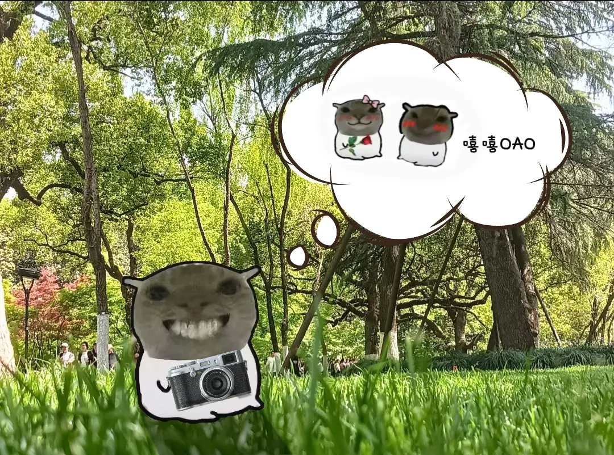
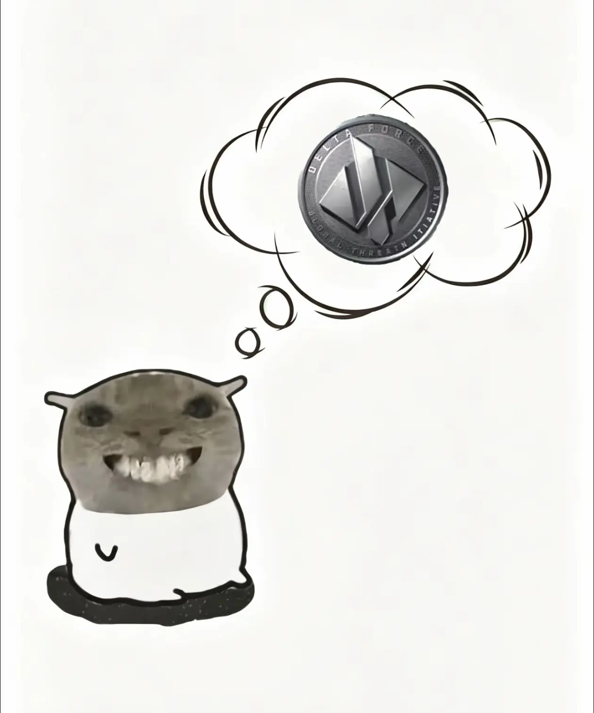
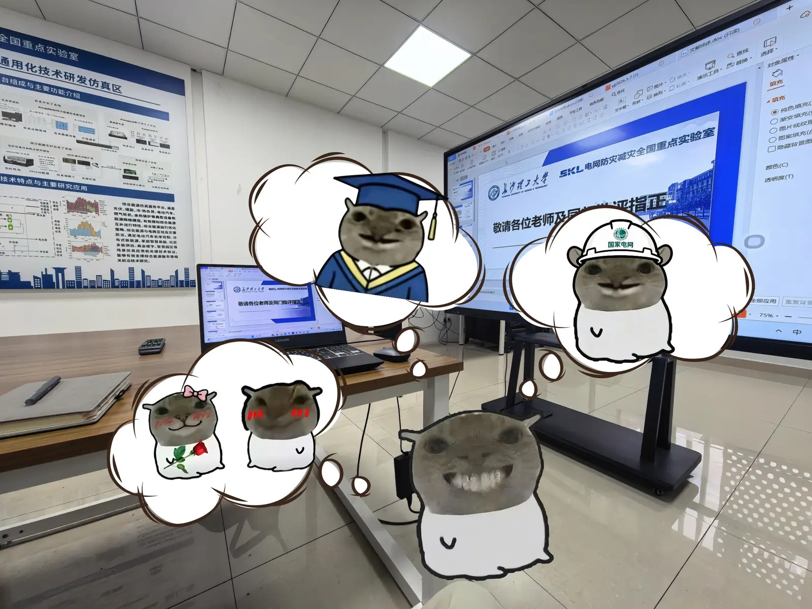

# 鼠鼠幻想插图 Skill

把抖音上流行的“鼠鼠的幻想”梗图做成一个可复用的 Codex Skill。

它用于生成这类画面：真实照片或白底模板里，一只低清鼠鼠贴纸站在现实场景中，头顶冒出粗糙手绘幻想云，云里是它正在幻想的身份、对象、奖励、恋爱、毕业、发财、上岸或高光时刻。



## 视觉核心

- 低清照片鼠鼠头，不是干净卡通头。
- 白色简笔布袋身体，粗黑描边。
- 头和身体明显像拼贴出来，不要自然融合。
- 幻想云是白色手绘云团，黑色/深棕重复描线。
- 中文默认不加；需要时只加“嘿嘿 / 嘻嘻 / OAO”这类情绪字。
- 幻想内容靠视觉符号表达，不写“我是汉密尔顿”“我发财了”这种说明字。



## 适合生成什么

- 校园、实验室、办公室、公园、旅行照里的鼠鼠幻想。
- 白底鼠鼠表情包模板。
- 多只鼠鼠各自幻想的小剧场。
- 鼠鼠幻想自己毕业、暴富、恋爱、上岸、被夸、领奖、当冠军。
- 给已有照片加鼠鼠、幻想云和道具。

## 不适合什么

- 精致品牌 IP。
- 儿童绘本风、Q 版贴纸包、3D 毛绒玩具。
- 统一画风的可爱仓鼠角色。
- 正式漫画分镜、海报、PPT 信息图。
- 靠大段文字解释笑点的图。

## 安装

推荐使用 Codex 的 skill installer，从 GitHub 子目录安装：

```text
Use $skill-installer to install https://github.com/jaimelove67/shushu-fantasy-illustrations/tree/main/shushu-fantasy-illustrations
```

等价的本地脚本命令是：

```powershell
python "$env:USERPROFILE\.codex\skills\.system\skill-installer\scripts\install-skill-from-github.py" --repo jaimelove67/shushu-fantasy-illustrations --path shushu-fantasy-illustrations
```

安装后重启 Codex，让新 skill 被发现。

也可以手动复制 skill 文件夹到 Codex skills 目录：

```powershell
Copy-Item -Recurse .\shushu-fantasy-illustrations "$env:USERPROFILE\.codex\skills\shushu-fantasy-illustrations"
```

之后在新会话中触发：

```text
Use $shushu-fantasy-illustrations to 给这张办公室照片做一张鼠鼠幻想图。
```

也可以直接说：

```text
生成一张鼠鼠开卡丁车，幻想自己是 F1 冠军车手的梗图。
```

## 为什么不能直接安装仓库根目录

这个 GitHub 仓库根目录是项目说明页，真正的 Codex Skill 在子目录：

```text
shushu-fantasy-illustrations/SKILL.md
```

Codex 的 skill installer 安装的是“包含 `SKILL.md` 的 skill 文件夹”，不是任意仓库首页。因此只给：

```text
https://github.com/jaimelove67/shushu-fantasy-illustrations
```

会找不到根目录下的 `SKILL.md`。必须使用 `/tree/main/shushu-fantasy-illustrations` 这个子目录链接，或在脚本里传 `--path shushu-fantasy-illustrations`。

## 生成原则

名人、职业、身份和成功幻想要用视觉符号表达：

- 赛车冠军：44 号赛车、头盔、领奖台、香槟、速度线。
- 毕业：学士帽、毕业袍、证书、校园台阶。
- 工程师：安全帽、工牌、蓝图、控制室。
- 摄影师：相机、取景框、大片姿势。
- 暴富：金币、奖杯、工资条、巨大硬币。
- 恋爱：玫瑰、腮红、两只鼠鼠靠近。

不要把这些写成解释句。图上的字越少越像参考风格。

## 目录结构

```text
shushu-fantasy-illustrations/
├── SKILL.md
├── agents/
│   └── openai.yaml
├── assets/
│   └── examples/
│       ├── 01-park-camera-fantasy.png
│       ├── 02-coin-fantasy-template.png
│       └── 03-lab-presentation-fantasy.png
└── references/
    ├── fantasy-bubbles.md
    ├── prompt-template.md
    ├── qa-checklist.md
    ├── reference-lock.md
    ├── shushu-ip.md
    └── style-dna.md
```

## 参考图



这些图片只用于风格校准。生成新图时不要默认复刻具体构图，而是保留“照片头 + 简笔身体 + 手绘幻想云 + 粗糙 P 图感”的视觉 DNA。
